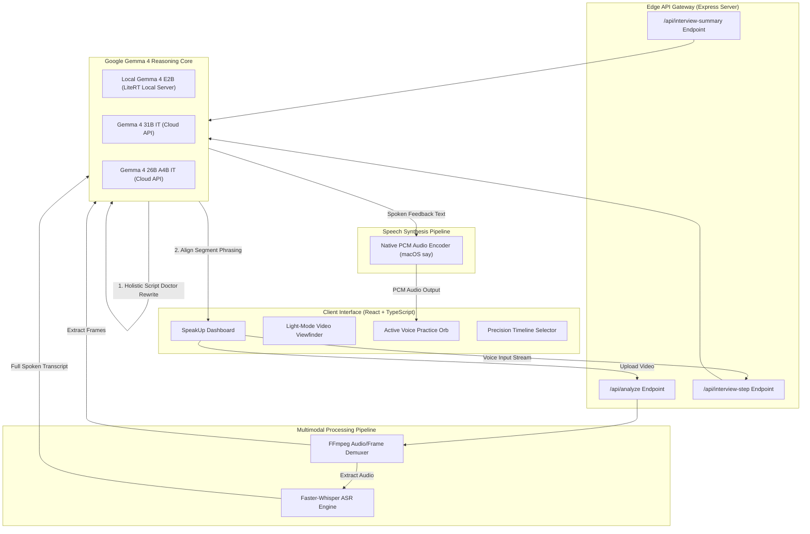

# 🎙️ SpeakUp.ai

> **Helping people become better speakers with the power of Google Gemma 4.**

SpeakUp.ai is an AI communication coach that helps people improve the way they speak, present, and communicate.

Whether you're preparing for a job interview, defending your final-year project, pitching investors, or giving a presentation, SpeakUp.ai watches how you communicate—not just what you say—and gives practical feedback to help you improve.

Unlike traditional AI assistants that only analyze text, SpeakUp.ai combines speech, vision, and conversational AI to evaluate your words, voice, body language, eye contact, posture, and overall delivery.

The goal isn't just to help you write better scripts. It's to help you become a better communicator.

Built with **Google Gemma 4**, SpeakUp.ai can analyze presentation videos, simulate realistic interviews, provide spoken feedback, and even run locally using LiteRT for fast, private, on-device coaching.

---

# Why We Built SpeakUp.ai

Good communication changes lives.

It helps students defend years of research with confidence. It helps job seekers perform better in interviews. It helps founders convince investors. It helps professionals present ideas clearly.

The problem is that most people don't have access to a personal communication coach before these important moments.

Today's AI tools can rewrite your script or fix your grammar, but they can't tell you if you're avoiding eye contact, speaking too fast, relying on filler words, or looking nervous while presenting.

Communication is more than words. It's how those words are delivered.

That's exactly what SpeakUp.ai was built to solve.

Using Google Gemma 4, SpeakUp.ai combines speech understanding, visual reasoning, and conversational intelligence to coach people the way a real presentation coach or interviewer would.

Instead of simply telling users what they did wrong, it explains why, shows them how to improve, and lets them practice until they feel confident.

Our goal is simple: **Make high-quality communication coaching available to anyone with a laptop.**

---

### ❤️ A Day with SpeakUp.ai

Sarah has her final-year project defense tomorrow. 

She knows her project inside out, but every time she presents, she speaks too quickly, avoids eye contact, and fills every pause with "um." 

She uploads her presentation to SpeakUp.ai. 

Within minutes, the AI points out exactly where her confidence drops, rewrites parts of her script to sound more natural, and walks her through a realistic mock defense with follow-up questions.

By the time she enters the examination room, she's no longer rehearsing what to say—she's focused on delivering it confidently.

That's the experience we wanted to build.

---

# Why Google Gemma 4?

SpeakUp.ai was designed around Google Gemma 4 from the beginning.

We wanted an AI that could do more than rewrite text—we wanted one that could understand communication the way people do.

When someone gives a presentation, we naturally pay attention to multiple things at once:
- What they're saying
- How they're saying it
- Whether they sound confident
- Their facial expressions
- Their posture
- Whether their body language matches their words

This requires reasoning across different types of information simultaneously. Gemma 4's multimodal capabilities made this possible.

For our project, Gemma 4 serves as the reasoning engine behind every major feature. It analyzes presentation transcripts, interprets visual observations extracted from video frames, conducts realistic interviews, rewrites presentation scripts, and generates personalized coaching based on the user's overall performance.

Another reason we chose Gemma 4 is its ability to run locally through LiteRT.

Many students, researchers, and professionals practice presentations containing confidential information that should never leave their device. Running Gemma locally allows SpeakUp.ai to provide private AI coaching without requiring an internet connection or sending sensitive videos to external servers.

Cloud models remain available whenever users want larger models, but local inference ensures the application remains accessible, affordable, and privacy-friendly.

---

# How SpeakUp.ai Works

Although SpeakUp.ai feels like a single AI assistant, it is actually made up of several specialized components working together.

The process begins when a user uploads a presentation video or starts an interactive interview session.

For presentation analysis:
1. The uploaded video is processed using FFmpeg to separate audio from video frames.
2. Faster-Whisper generates an accurate transcript of everything the speaker says.
3. Important video frames are extracted and sent to Gemma 4 for visual analysis.
4. Gemma combines both the transcript and visual observations to understand the presentation as a whole.
5. SpeakUp.ai generates detailed coaching, presentation scores, body language feedback, and an improved version of the user's script.

For interview practice:
1. Gemma acts as a realistic interviewer or examiner.
2. The user answers naturally using their microphone.
3. SpeakUp.ai automatically detects when the speaker has finished talking.
4. Gemma evaluates the response and generates an intelligent follow-up question.
5. At the end of the session, users receive a complete performance report together with spoken feedback highlighting strengths and areas for improvement.

This creates a natural conversation without requiring users to constantly press buttons or manually control the interview flow.

---

# What SpeakUp.ai Can Do

### 🎤 Presentation Coach
Upload a presentation and receive detailed feedback on your speech, delivery, confidence, pacing, body language, and overall communication style.

Instead of simply pointing out mistakes, SpeakUp.ai explains why they matter and suggests practical improvements.

---

### 🎓 AI Interview & Thesis Examiner
Practice realistic interviews for:
- Job interviews
- Final-year project defenses
- Thesis presentations
- Scholarship interviews
- Startup investor pitches

The AI responds like a real interviewer by asking follow-up questions based on your previous answers rather than following a fixed script.

---

### ✍️ AI Script Improvement
SpeakUp.ai rewrites presentations to make them clearer, more persuasive, and easier to deliver while preserving the speaker's original message and intent.

---

### 👀 Body Language Analysis
Using Gemma 4's visual reasoning capabilities, SpeakUp.ai evaluates posture, eye contact, facial expressions, and presentation confidence to identify habits that may affect communication.

---

### 🔊 Spoken AI Feedback
At the end of every coaching session, SpeakUp.ai doesn't just display results—it explains them.

Users receive a spoken performance review summarizing their strengths, weaknesses, and personalized recommendations for improvement.

---

### 💻 Local AI Support
SpeakUp.ai can run entirely on-device using Google Gemma 4 through LiteRT.

This allows users to practice presentations privately, even without an internet connection, making the application especially useful for students, professionals, and organizations working with sensitive information.

---

## 🏗️ System Architecture

To support real-time audio interaction and local multimodal processing, SpeakUp.ai is divided into a high-performance web client and an edge-capable server pipeline.



### End-to-End Request Flow
1. **Presentation Ingestion**: The user uploads or records a presentation video in the dashboard interface.
2. **Asynchronous Demuxing**: The server extracts raw audio as mono-channel 16kHz PCM WAV (optimal for transcribers) and extracts video frames at fixed intervals.
3. **ASR Transcription**: Faster-Whisper processes the audio file, outputting exact timestamps and word groups.
4. **Holistic Gemma Evaluation**: Rather than analyzing chunks out-of-context, the server packages the whole transcript and frame data into a single request. Gemma constructs a cohesive rewritten script and aligns segments.
5. **Real-time Voice Dialog**: During the mock interview stage, voice responses are submitted hands-free. Gemma routes these dynamically to create contextual follow-up questions.

### Design Rationale
We designed the architecture around **minimizing inference roundtrips** and **maximizing context windows**. By performing speech recognition and frame extraction locally on the server, we avoid sending huge payloads. When Cloud APIs are active, only compressed frame buffers and clean text transcripts are transmitted, keeping network overhead minimal and latency low.

---

## 🧠 Inside the AI Pipeline

SpeakUp.ai's pipeline behaves like an executive editor and performance coach. Here's a deep-dive look at the engineering under the hood:

### Video Processing & Frame Extraction
We use FFmpeg to sample frames at regular intervals based on the total video duration. This reduces visual noise and avoids feeding redundant frames to Gemma 4's vision decoder, which preserves computing resources during local execution.
```bash
ffmpeg -y -ss {timestamp} -i video.mp4 -vframes 1 -q:v 2 frame.jpg
```

### Whisper Transcription
We integrate `faster-whisper` because it runs up to 4x faster than standard OpenAI Whisper implementations with the same accuracy. This gives us sub-second transcription for short recordings.

### Holistic Prompt Engineering
To prevent fragmented segment rewrites (a common issue in traditional clip coaches), we use a structured prompt that passes the full transcript alongside the segment boundaries:
```
INSTRUCTIONS:
1. First, professionally rewrite the ENTIRE spoken script. The new script should flow naturally from start to finish as one continuous speech.
2. Align/assign the appropriate section of this new professional script to the corresponding timeline segment ("better_phrasing" field).
```

### Model Routing
The application dynamically routes queries:
* **Local Mode**: Uses `gemma-4-e2b` running locally on port `9379`.
* **Production/Cloud Mode**: Routes larger reasoning tasks to `gemma-4-31b-it` or `gemma-4-26b-a4b` via Google Cloud API key credentials.

### Conversation Memory & Context Management
During active mock interviews, we maintain an incremental conversational history. Each turn is appraised against the **STAR (Situation, Task, Action, Result)** model, enabling the examiner to ask highly relevant follow-up questions instead of static pre-written cues.

---

## 🔒 Why Local AI Matters

On-device inference is not just a feature—it is a necessity for making technology accessible and private.

*   **Privacy & Data Ownership**: Executive pitches, research paper defense material, and medical presentations contain valuable intellectual property. On-device execution ensures that sensitive data never leaves the user's laptop.
*   **Accessible Education (Low Bandwidth & Africa)**: In regions with low connectivity, downloading massive models or constantly calling cloud APIs is impossible. SpeakUp.ai can run entirely offline with `APP_MODE=local`, enabling students globally to access coaching.
*   **Zero Marginal Cost**: Standard API-driven coaches charge per minute of video analyzed. SpeakUp.ai runs locally for free, making unlimited practices viable for everyone.
*   **Low Latency Edge Interaction**: Hands-free conversation requires low response latency. Running the model on the local device minimizes network roundtrips, making conversation feel immediate.

---

## 💎 How We Used Gemma 4

We designed SpeakUp.ai around Gemma 4's key strengths rather than treating the LLM as a generic text box.

| Feature | Gemma Capability | Why It Matters |
| :--- | :--- | :--- |
| **Multimodal Presentation Analysis** | Joint Vision & Text Processing | Evaluates visual posture cues, gestures, and eye contact simultaneously with spoken words. |
| **Holistic Script Doctor** | Long Context Reasoner | Rewrites complete presentation scripts cohesively before assigning sections to individual timeline segments. |
| **Interactive Defense Examiner** | Chat & Roleplay Logic | Simulates academic panels (thesis boards, PhD examiners) with dynamic, context-aware follow-up questions. |
| **On-device Speech Diagnosis** | LiteRT Local Inference | Allows the complete coach workspace to run offline on standard consumer hardware. |

---

## 🧪 Technical Implementation

Below is a directory map showing where crucial features are implemented:

*   **API Router & Local/Cloud Selection**:
    See `queryAI()` inside [server.ts](server.ts#L61-L105).
*   **Local OpenAI-Compatible Client**:
    See `queryGemma()` inside [server.ts](server.ts#L21-L58). This manages the POST request payloads sent to the local `LITERT_SERVER_URL`.
*   **Gemma 4 Vision Posture & Eye Contact Analysis**:
    See `extractVisionObservation()` inside [server.ts](server.ts#L370-L409).
*   **Holistic Script Doctor Rewrite**:
    See the `/api/analyze` post route inside [server.ts](server.ts#L977-L1112).
*   **STAR Interview Turn Processing & Audio Loop**:
    See the `/api/interview-step` post route inside [server.ts](server.ts#L1220-L1255).
*   **Spoken Examiner Debrief Report**:
    See the `/api/interview-summary` post route inside [server.ts](server.ts#L1290-L1350).
*   **Dynamic Client Viewfinder & Video Control**:
    See [VideoStage.tsx](components/VideoStage.tsx).
*   **Interactive Evaluation Dashboard**:
    See [AnalysisView.tsx](components/AnalysisView.tsx).

---

## 🚀 Getting Started

Follow these step-by-step instructions to run SpeakUp.ai locally on your machine.

---

### 📋 Prerequisites & System Packages

Before running the application, make sure you have the following installed on your system:

#### 1. Node.js (v18 or higher)
- **macOS / Linux / Windows**: Download and install Node.js from [nodejs.org](https://nodejs.org/).

#### 2. FFmpeg (Audio extraction & video frame demuxing)
FFmpeg is required for extracting audio and visual frames from presentation videos.
- **macOS (Homebrew)**:
  ```bash
  brew install ffmpeg
  ```
- **Linux (Ubuntu / Debian / Render)**:
  ```bash
  sudo apt update && sudo apt install -y ffmpeg
  ```
- **Windows (Chocolatey / Scoop)**:
  ```bash
  choco install ffmpeg
  # OR
  scoop install ffmpeg
  ```

#### 3. Python 3.9+ & Faster-Whisper ASR
Faster-Whisper provides fast, local speech-to-text recognition.
1. Create and activate a Python virtual environment inside the project directory:
   ```bash
   # macOS / Linux
   python3 -m venv .venv
   source .venv/bin/activate

   # Windows (Command Prompt / PowerShell)
   python -m venv .venv
   .venv\Scripts\activate
   ```
2. Install `faster-whisper` and `edge-tts`:
   ```bash
   pip install --upgrade pip
   pip install faster-whisper edge-tts
   ```

---

### ⚙️ Step-by-Step Installation

#### Step 1: Clone the Repository
```bash
git clone https://github.com/Icekid35/speakup-ai.git
cd speakup-ai
```

#### Step 2: Install Node Dependencies
```bash
npm install
```

#### Step 3: Configure Environment Variables
Create a `.env` file in the root directory (or copy from `.env.example`):
```bash
cp .env.example .env
```

Edit `.env` and set your desired mode and API keys:
```env
# Application Mode: 'local' (on-device LiteRT) or 'production' (Cloud API)
NEXT_PUBLIC_APP_MODE=local

# Google Cloud Gemini API Key (get a free key at https://aistudio.google.com/)
NEXT_PUBLIC_GEMINI_API_KEY=your_gemini_api_key_here
NEXT_PUBLIC_GEMINI_MODEL=gemma-4-31b-it

# Optional: Groq Whisper API for sub-second, zero-RAM cloud speech transcription
# (Get a free key at https://console.groq.com/keys)
NEXT_PUBLIC_GROQ_API_KEY=your_groq_api_key_here
```

---

### 🤖 Running Local Gemma 4 (Optional — for Offline On-Device Mode)

If you want to run **Google Gemma 4** completely offline on your device:

1. Install **LiteRT-LM** (Official Google Runtime):
   ```bash
   pip install litert-lm
   ```
2. Download the Gemma 4 E2B model:
   ```bash
   litert-lm download google/gemma-4-e2b
   ```
3. Start the local inference server on port `9379`:
   ```bash
   litert-lm serve --model google/gemma-4-e2b --port 9379
   ```

---

### 💻 Launching the Application

Start the local server and dev environment:
```bash
npm run dev
```

Open **`http://localhost:3000`** in your browser.

---

## 🌍 Future Vision

We want to expand SpeakUp.ai beyond basic presentation coaching:

*   **Integrated Virtual Coach**: Real-time delivery evaluation overlay during Google Meet, Zoom, and MS Teams meetings.
*   **Edge Mobile Application**: Mobile companion app utilizing on-device Gemma models for low-latency feedback.
*   **Sales & Negotiations Training**: Specialized scenarios for customer negotiations, pitches, and board review preparation.
*   **Global Access (African Languages)**: Localized speech model training to support non-English presentations and dialects.
*   **Accessibility Mode**: Specialized features for public speaking training for people with speech impediments or high anxiety.

---

## 📝 License
This project is licensed under the MIT License - see the [LICENSE](LICENSE) file for details.